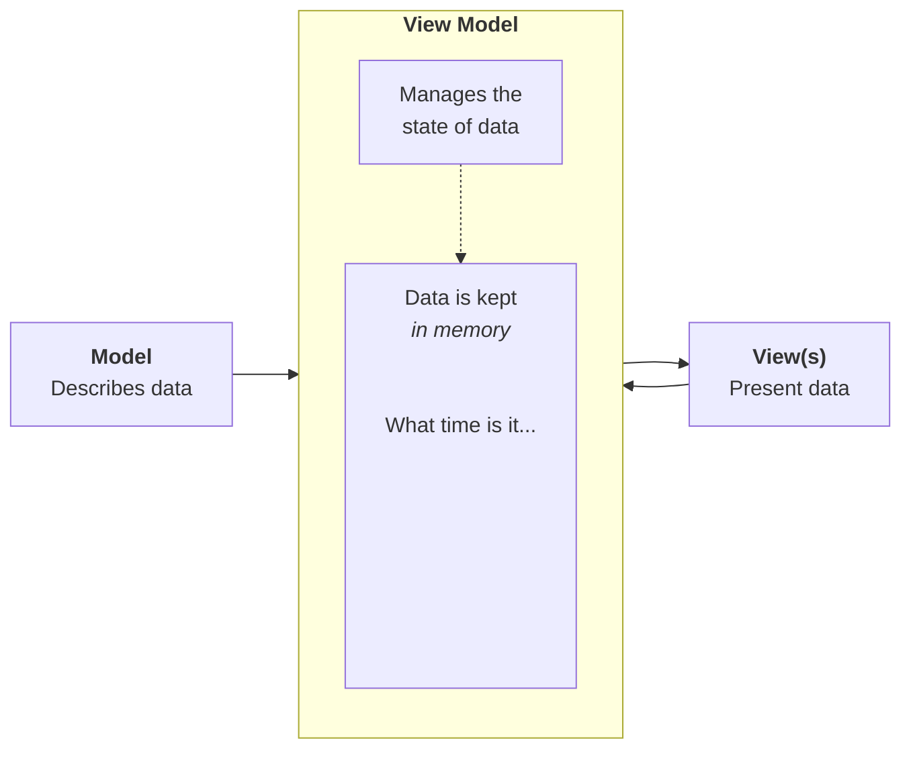

---
{"dg-publish":true,"permalink":"/tutorials/creating-a-to-do-list-app-part-6/","dgHomeLink":true,"dgShowToc":true}
---


# Creating a To-do List App, Part 6

In [[Tutorials/Creating a To-do List App, Part 5\|part five]] of this task, you learned about the MVVM design pattern and how it promotes separation of concerns within an app. You set up a Supabase account and created a database to store the to-do list items. Finally, you saw how Supabase sends data from the database over the World Wide Web.

In this continuation of that tutorial, you will learn how to consume data from a Supabase cloud-hosted database directly within an iOS app.

## Unpause your database

If you completed part 5 of this tutorial series in the prior module here at LCS, it's quite likely that your database, hosted by Supabase, has been paused to conserve server-side resources. This occurs automatically for free-tier projects at Supabase when a database has been inactive for 7 days. 

To get started, first be sure you are [signed in at GitHub](https://github.com/login).

> [!REMINDER]
> 
> It's been a while, but recall that when you created a Supabase account, you [[Tutorials/Creating a To-do List App, Part 5#Create an account\|used your GitHub credentials]].

Now, visit the [sign in page at Supabase](https://supabase.com/dashboard) and you will see a page like this:


Please choose **Continue with GitHub**.

After a moment, you will see your dashboard at Supabase:


Notice that your project is likely listed as paused. If you click on your project to open it, you will see this message:


Just press the green **Restore project** button and then press it again on the confirmation screen:


You will see this message for a few minutes. Since your database is very small, it won't take long to restore:


When restoration is complete, you will see a screen like this one:


Select the **Table Editor** button and then select the `todos` table at left:


You should then see whatever to-do list items you created in [[Tutorials/Creating a To-do List App, Part 5\|part 5 of this tutorial series]]:


## Understanding JSON

In part 5 you learned how to [[Tutorials/Creating a To-do List App, Part 5#Fetching table data\|see the items in your database table]] over the web, except you used the `curl` command-line app as your "web browser".

Right-click and [[Tutorials/Creating a To-do List App, Part 5#Fetching table data\|open those instructions again]]. Follow them to refresh your memory so that you see output like this in the terminal:


So, what is this information that was returned when we made our request to the database?

```json
[{"id":1,"title":"Call Mom","done":false}, 
 {"id":2,"title":"Go for a run","done":false}, 
 {"id":3,"title":"Have a nap","done":false}]
```

The information shown there is simply plain text – however, certain rules are followed so that the information is in a predictable format.

**JavaScript Object Notation** format, or **JSON**, is the set of rules being used to format the information sent to us by the Supabase platform.

In JSON:

- square brackets mark the start and end of an array
- curly brackets mark the start and end of an object
- an object is composed of data
	- data are sent in name/value pairs
		- the name comes before a colon
		- the value comes after a colon

So for this data:

```json
[{"id":1,"title":"Call Mom","done":false}, 
 {"id":2,"title":"Go for a run","done":false}, 
 {"id":3,"title":"Have a nap","done":false}]
```

... there is:

- one array
- three objects are in the array
- each object has three name/value pairs

Our goal is to get that data out of it's plain-text JSON format, and into the Swift data structures we set up in part 5. 

Each JSON object will correspond to an instance of our `TodoItem` structure:

```swift
struct TodoItem: Identifiable {
    let id = UUID()
    var title: String
    var done:  Bool
}
```

The JSON array corresponds to the `todos` array we set up in our view model:


We are going to use the framework provided by Supabase so that this process of converting data kept in JSON format into Swift data structures is super convenient and automatic.

> [!NOTE]
> 
> Eagle-eyed readers may have noticed that the `id` property being sent to us by Supabase is a simple integer value (`1`, `2`, `3`, and so on) but the `id` property in our `TodoItem` structure is a `UUID` or universally-unique identifier, which looks something like this: `5F944282-A194-4A6C-A1E4-2022FBD8D8A8`
> 
> Don't worry. We'll fix this, and it's easy!

## Adding the Supabase framework

To add the Supabase framework, from the menus, select **File > Add Package Dependences...**:


Paste the address shown here in the top-right corner:

```
https://github.com/supabase-community/supabase-swift
```

You should see the following:


Then select **Add Package** and you will see this screen briefly:


On the screen that appears, expand the window if needed, then for each package product shown, change the option for the **Add to Target** column to read **TodoList** (this is the app or target name of your project):


Finally, press the **Add Package** button:


If all goes well you will see the frameworks that have been added in the lower left corner of the Xcode window: 


## Modifying the view model

A tremendous benefit of separating concerns within an app is that when you make changes to how data is persisted, the view layer never needs to know about it, and so no source code in the view layer needs to be modified.

Here is the current overall architecture of our to-do list app:




