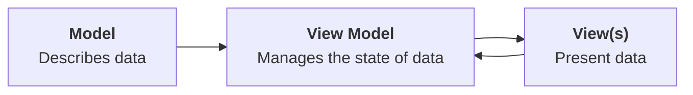

---
{"dg-publish":true,"permalink":"/tutorials/creating-a-to-do-list-app-part-7/","dgHomeLink":true,"dgShowToc":true}
---


# Creating a To-do List App, Part 6

In [[Tutorials/Creating a To-do List App, Part 6\|part six]] of this task, you learned how to implement all the functionality required to create, read, update, and delete data from a database hosted at Supabase. That knowledge will be directly applicable to the app you build for your culminating task.

In this continuation of that tutorial, you will learn how to make search work within the to-do app, how to correct a critical security flaw with the current configuration of your database, and how to allow the user to select a photo to go along with a to-do item – and how to save that photo in the cloud.

## Search data in the cloud

As the list of to-do items stored by a user grows, it would be ideal to be able to filter, or search, the list of items.

At present, search does not work:


To search, or filter, the list of to-do items, you will be interacting with the database through the Supabase framework to run code equivalent to an SQL statement like this:

```sql
SELECT *
FROM todos
WHERE title LIKE "%nap%"
```

### Adjust the view model

The first step is to add another function to the view model.

Switch to the `TodoListViewModel` file and fold up the existing functions so that they look like this:


Now, copy and paste the code below to add a new function at the end of the list of existing functions – be sure the new function goes inside the `TodoListViewModel` class – that is, before the closing `}` bracket:

```swift
func filterTodos(on searchTerm: String) async throws {

	if searchTerm.isEmpty {

		// Get all the to-dos
		Task {
			try await getTodos()
		}

	} else {

		// Get a filtered list of to-dos
		do {
			let results: [TodoItem] = try await supabase
				.from("todos")
				.select()
				.ilike("title", pattern: "%\(searchTerm)%")
				.order("id", ascending: true)
				.execute()
				.value

			self.todos = results

		} catch {
			debugPrint(error)
		}

	}

}
```

... like this:


Let's break that function down a bit.

> [!Discussion]
> 
> 1. The `filterTodos` function accepts a single argument of type `String`, with an external parameter name of `on`. Whatever data is passed in to the parameter will be accessible inside the function using the internal parameter name of `searchTerm`.
>    &nbsp;<br/>
> 2. When the provided search term is empty, the complete list of to-do items is fetched from the cloud-hosted database.
>    &nbsp;<br/>
> 3. When the provided search term is not empty, we invoke a series of function calls to run a select statement with a `WHERE` clause, limiting results to rows where data in the `title` column contains whatever was provided in the search term. We then assign these results to the `todos` array. Since the view model is marked with `@Observable`, when the contents of the `todos` array are changed, the user interface of our app will be updated.
>    
>    Note that the `ilike` function is a case insensitive search. That means a search term of `For` would match a to-do item with a title of `Go for a run`.
>    
>    If you use the `like` function in the same way, results are case sensitive. In that case, a search term of `For` would *not* match a to-do item with a title of `Go for a run`.

Before continuing with this tutorial, it is worth briefly reviewing, and then bookmarking [this section of the Supabase documentation](https://supabase.com/docs/reference/javascript/using-filters). It is quite likely you will need to query and filter data that exists in your database while authoring your culminating task app – so, this documentation will be a helpful reference.

### Adjust the view

Now that we have a new function in the view model that finds to-do items whose title contains a provided search term, we must modify the view so that it makes use of this new function. 

Remember that in general, this is how the MVVM (model, view, view model) design pattern works:



In our view, at present, it is the `.searchable` view modifier:


... attached to the `List` structure that adds the search field to our user interface:


The search field has a binding to the `searchText` stored property. So, whenever the user types something into the search field, the contents of `searchText` will be updated.

We need to make our app react to changes in the `searchText` stored property.

To do this, copy the following code and then add it below the `.searchable` view modifier:

```swift
.onChange(of: searchText) {
	Task {
		try await viewModel.filterTodos(on: searchText)
	}
}
```

...like this:


If needed, press **Command-`A`** and then **Control-`I`** to re-indent your code and keep it tidy.

Now, whenever the value of the `searchText` stored property changes, a task – a block of asynchronous work – will be started. This block of code invokes the `filterTodos` function that we just added to the view model, passing in `searchText` as the argument for the `on` parameter.

As described earlier, that will cause the `todos` array to be refreshed and limited to rows in the `todos` table in our database whose `title` column data contains the provided search text.

Try this out in your app now. You should see something like the following:


This is important progress, so please be sure to commit and push your work at this point with the following message:

```
Added the ability to search and filter the list of to-do items.
```

## Enable row-level security (RLS)

To keep things simple when we started to use Supabase, we initially [[Tutorials/Creating a To-do List App, Part 5#Create a table\|disabled row-level security]] on the `todos` table.

What does that mean, though?

To understand this, try running your app on a different device in the Simulator, or, watch and consider the short video below.

Each Simulator device is equivalent to a different physical device.

So if you try out your app on an iPhone 15 Pro in the Simulator, and then you also try out your app on an iPhone 15 in the Simulator, this is like running your app on two different physical devices. 

Let's see what this looks like as a video:

<figure style="width: 640px;">
	<video width="640" controls preload="metadata">
	  <source src="https://www.russellgordon.ca/lcs/2023-24/ics3u/no-row-level-security.mp4" type="video/mp4">
	Your browser does not support the video tag.
	</video>
</figure>